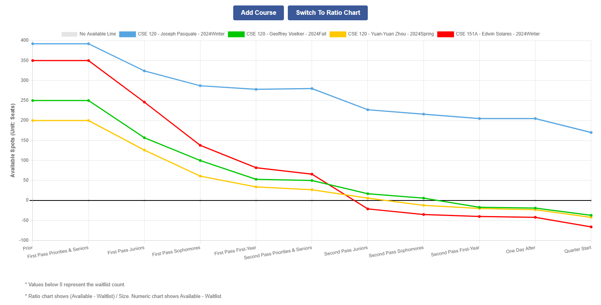

# UCSD Registration Trend



> Sample Course Registration Trend For CSE 120

A web application that visualizes UCSD course registration trends from 2024 up to now, helping students make informed decisions during their first and second pass enrollment periods.

🌐 Website: [www.ucsdregistration.com](https://www.ucsdregistration.com)  
📊 Data Source: [UCSD Historical Enrollment Data](https://github.com/UCSD-Historical-Enrollment-Data/UCSDHistEnrollData.git)

---

## 🔍 Why We Built This

While studying at UC San Diego, I often found myself unsure which courses would fill up quickly during registration. This uncertainty made it difficult to prioritize courses during the first and second pass periods.

While taking COGS-108, I came across a dataset that tracks course enrollment activity at UCSD. I decided to build this tool to make that data more accessible and helpful for other students like me.

---

## 📈 Features

- View **registration trends** for each course and professor across different quarters.
- Compare **available seats**, **course size**, and **waitlist counts** over time.
- See data in both **numerical and percentage formats**.
- Group **multi-section professors** into a single, unified view.
- Comment on the course/professor you are interested in. (Suspend)

---

## 🧠 Tech Stack

- **Data Cleaning**: Azure Databricks with PySpark
- **Current Runtime**: Static HTML, CSS, JavaScript, and pre-generated JSON files
- **Frontend**: Vanilla HTML/CSS/JS in `old_frontend/public`
- **Static Data Generation**: Python script that converts cleaned CSV tables into course JSON files
- **Legacy Backend**: Spring Boot + MySQL code is kept for reference and learning
- **Recommended Deployment**: Cloudflare Pages or GitHub Pages

---

## 📁 Project Structure

- **[docs](./docs)**: Documentation including API references, database schema, and personal development notes.
- **[data](./data)**: Python notebooks and scripts for data cleaning and analysis. Also includes automation scripts that upload cleaned data to the RDS database.
- **[backend](./backend)**: Backend source code built with Spring Boot and Maven.
- **[frontend](./frontend)**: Modern frontend implementation using ReactJS.
- **[old frontend](./old_frontend)**: The currently deployed frontend using vanilla HTML, CSS, JS, and generated static JSON data.

### Static Site Data

The current low-cost deployment path does not require EC2, RDS, Spring Boot, or a live API server. Generate static course JSON files with:

```bash
python data/generate_static_course_data.py
```

This writes course-level JSON files into `old_frontend/public/data/courses/`, which the frontend loads directly.

---

## 📦 Data Source

[UCSD Historical Enrollment Data](https://github.com/UCSD-Historical-Enrollment-Data/UCSDHistEnrollData.git)
This project is maintained by UCSD students and periodically scrapes raw registration data from WebReg. The dataset includes both raw and cleaned data. While their cleaned version is detailed and comprehensive, it did not align exactly with our use case. Therefore, we reprocessed the raw dataset, performed custom cleaning and aggregation, and added additional derived fields.

**Special thanks to the maintainers of this project. Without their original data, this website would not have existed.**

---

## 👨‍💻 Contributors

| Name         | Responsibilities                                                                                       |
| ------------ | ------------------------------------------------------------------------------------------------------ |
| **Rui Li**   | Data cleaning, database setup and maintenance, backend development and deployment, project maintenance |
| **Rong Jin** | Frontend development, UI/UX design, project maintenance                                                |

---

## 📊 UCSD Course Registration Data Analysis

If you're interested in the analysis behind UCSD course registration trends, here's an early-stage exploratory notebook that includes data parsing, cleaning, exploratory analysis, machine learning, and forecasting:

👉 [Colab Notebook](https://colab.research.google.com/drive/1NbM8z0QhziBPPLQWjJMJBkh18vvzOBN7?usp=sharing#scrollTo=yMJmggrMp9Uo)

> This is an old data analyze notebook using numpy and pandas which made by me and classmates during University. If you want to check the data cleaning process for this project, please check [data cleaning scripts](./data)
